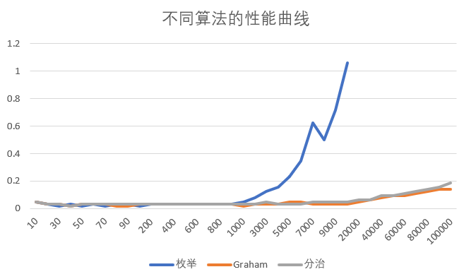

# 实验一：分治算法

## 实现基于枚举方法的凸包求解算法

若规定逆时针方向为正方向，如果这条边在凸包上，当且仅当其所在直线外侧没有任何点。因此考虑枚举每条有向线段，判断其外侧是否有点即可。时间复杂度为 $\mathcal{O}(n^3)$，空间复杂度为 $\mathcal{O}(n)$。

需要注意的是，这种方法无法排除凸包上共线的点，需要在最后使用一些方法去除。

实现代码参考 `naive.cpp`。

## 实现基于 Graham-Scan 的凸包求解算法

时间复杂度 $\mathcal{O}(n\log n)$，空间复杂度 $\mathcal{O}(n)$。

实现代码参考 `graham.cpp`。

## 实现基于分治思想的凸包求解算法

时间复杂度 $\mathcal{O}(n\log n)$，空间复杂度 $\mathcal{O}(n)$。

实现代码参考 `dc.cpp`。

## 对比三种凸包求解算法

### 生成随机点

由于 $100\times 100$ 范围内的点总数只有 $10^4$ 量级，无法生成 $10^5$ 量级的数据（数据不生成重复点），因此生成时点的范围在 $10^4\times 10^4$ 范围内，且只考虑整数点。使用 [testlib](https://github.com/MikeMirzayanov/testlib) 库进行数据的生成。

若要生成 $n\times n$ 范围的随机点，可以生成两个 $[0,n]$ 范围的均匀随机数作为该点的横纵坐标。由于 $P(X=x)=P(Y=y)=\frac{1}{n+1}$，且生成横纵坐标的过程互相独立，所以 $P((X,Y)=(x,y))=\frac{1}{(n+1)^2}$，与范围内均匀随机选取整数点选中 $(x,y)$ 的概率相同，可以认为这样生成的点具有均匀随机的性质。

数据生成器见 `gen.cpp`。

### 运行算法并记录

统一运行三份程序，见 `invoke.cpp`。由于同一凸包可以有多种描述方法，因此另使用 testlib 库编写了一个检查器，用于检查三份程序输出的凸包是否为同一凸包。见 `checker.cpp`。

测试中选取 $\{i\cdot n\mid i=1,2,\ldots,10,n=10,100,\ldots,10^5\}$ 的数据，在每次运行后比对三份程序的输出，均通过检查。记录时间如下折线图所示。

可以发现，Graham-Scan 方法和分治法的运行时间大体接近，枚举算法在 $n>10^3$ 的数据下耗时显著增加。在 $n=8000$ 时的拐点可能由于测试时运行环境不稳定造成时间测量有误差。总体性能曲线基本符合预期。

P.S. 在 [*On the Average Number of Maxima in a Set of Vectors and Applications*](https://dl.acm.org/doi/10.1145/322092.322095) 的定理 4 中已经证明了在平面上随机点形成的凸包大小为 $\mathcal{O}(\ln n)$。
