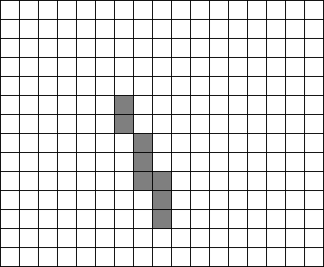
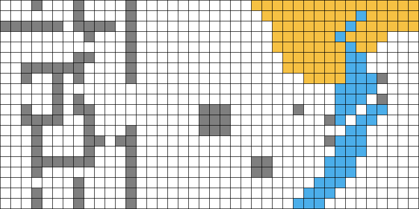
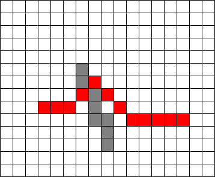
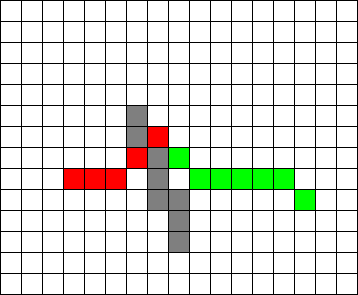
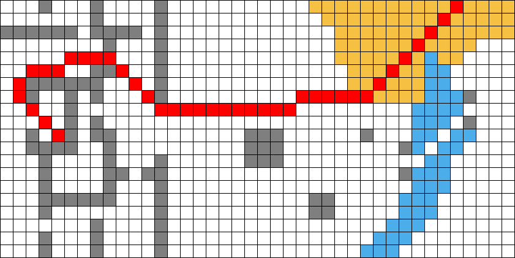
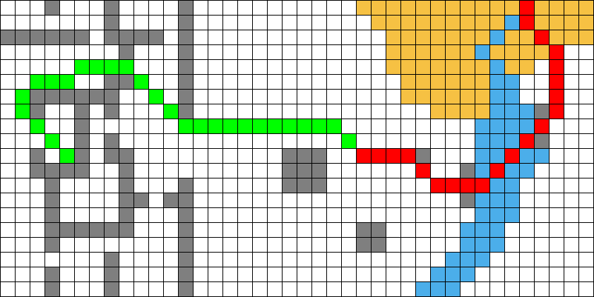

# 实验二：搜索算法

## 实现单向与双向的 A* 搜索算法

首先对给出的地图进行规整，每个方格区域大小规定为 $20\times 20$ 像素，线宽 $1$ 像素。规整后的地图如下所示。

基于此实现读取与保存地图，详见 `io_map.py`。

为了实现 A* 算法，定义每个方格的状态 `AreaBlock` 类，包含上一步状态 `fr`，用于双向 A* 算法，记录到达这个方格的起点 `kind`，目前位置 `x` 和 `y`，目前的 $g(n)$ 和 $f(n)$ 的函数值 `g` 和 `f`。由于题目中涉及的运算均可以在 $\mathbb{Q}(\sqrt 2)$ 下完成，因此同样定义 `Q_2` 类来辅助计算。详见 `blocks.py`。

然后实现 A* 算法，启发式函数 $h(n)$ 定义为不考虑障碍的情况下从这个点到终点的最短距离，这个距离一定是先进行一定步数的水平或竖直移动，然后斜向移动。双向 A* 算法使用两个优先队列，分别从起点和终点出发进行 A* 搜索。在一次搜索中，扩展队列长度较短的一方，如果对方已经搜索到此节点，则将两部分路径连接起来即为答案路径，否则进行扩展搜索。

由于优先队列不支持 $\mathcal{O}(\log n)$ 的查找和修改，因此代码中仅朴素实现了这个过程。实际上使用平衡树可以进行 $\mathcal{O}(\log n)$ 的查找和修改，但 Python 并未原生支持平衡树容器，因此并没有实现平衡树。

单向 A* 算法实现见 `a_star.py`，双向 A* 算法实现见 `a_star_bid.py`。

## 测试与结果可视化

对于效果图，红色表示一条路径，绿色表示另一条路径。

对于第一张地图，使用单向 A* 算法的结果如下。

使用双向 A* 算法的结果如下。

两份代码给出的路径是等价的，代价均为 $6+5\sqrt 2$。

对于第二张地图，使用单向 A* 算法的结果如下。

代价为 $43+17\sqrt 2$。

使用双向 A* 算法的结果如下。

代价为 $35+20\sqrt 2$。

由于单向 A* 会返回一条步数尽可能少的到达终点的路径，而双向 A* 可以避免步数的影响，因此双向 A* 算法找到了一条代价更小的路径。
