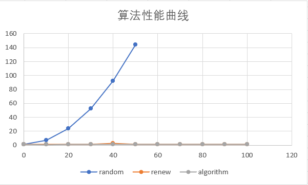

# 实验四：快速排序

## 按照算法导论中给出的伪代码实现快速排序

详见 `quick_sort_random.cpp`。

## 测试算法在不同输入下的表现

使用 `invoke.cpp` 运行两个程序。结果如 `result.txt` 所示。算法性能曲线如下。

实验中发现，对于 $k=0\%$ 的数据，加入随机算法可以获得较好的结果，但是在之后的测试中使用随机算法的效率极低。虽不至于达到 $\mathcal{O}(n^2)$ 复杂度的运行时间，但效率远低于 $\mathcal{O}(n\log n)$ 的排序算法。

## 思考并解决问题

使用 C++ STL 中提供的 `std::sort` 进行基准测试。详见 `quick_sort_algorithm.cpp`。

由于相同元素比重较大，因此在一段排完序后，会生成一段较长的相同数组成的数列。此时我们只需要考虑数列两边的数，对其排序即可，不需要再考虑中间部分。因此基于 [Dutch national flag problem](https://en.wikipedia.org/wiki/Dutch_national_flag_problem) 设计三路快速排序。首先在需要排序的段中随机选择分点 $m$。将待排数列划分为三个部分：小于 $m$、等于 $m$ 以及大于 $m$。然后递归排序小于 $m$ 和大于 $m$ 的部分即可。在重复元素较多的情况下效率接近于 `std::sort`。

`std::sort` 使用内省排序，结合了快速排序和堆排序，保证了最差时间复杂度为 $\mathcal{O}(n\log n)$。参考 C++ STL 的实现，在改进实现中也加入了如果需要排序的段长度小于等于 $16$ 则进行插入排序。

改进实现性能与 `std::sort` 相当，详见 `quick_sort_random_renew.cpp`。
