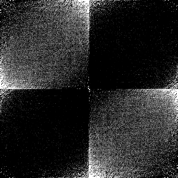
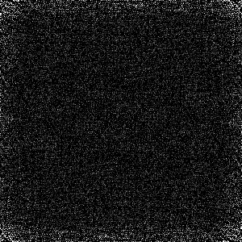

# 综合课程设计一：针对二维码的认证技术

数字签名：张晴宇，黄枥锐。

数字水印：杨贺然。

数字水印部分的相关介绍在[计算机 · 关于数字水印的一些实现问题和不成熟想法 - 知乎](https://zhuanlan.zhihu.com/p/100277681)也有。

数字水印部分采用 DFT 后将水印乘以能量系数后直接在频域上相加的方法，效果观感很差。但是现有利用 DFT 进行水印嵌入的实现貌似效果都不很理想。见知乎[阿里巴巴公司根据截图查到泄露信息的具体员工的技术是什么？](https://www.zhihu.com/question/50735753)

主要原因是进行 DFT 叠加后的结果必然超出了 RGB 空间。从数学上来说，感觉任何以变换后叠加的方式进行的水印嵌入都无法避免得到的结果超出 RGB 空间的问题，还有 DFT 自带的比较严重的精度问题。这样也就导致得到的水印信息只能尽可能与原水印相同而不能完全一致。并且叠加的效果应与图片本身和能量系数的取值有关。

甚至水印为全黑或全白，嵌入后保存到图片再提取都无法提取出纯色的水印……两者提取后的图片如下：

添加白色水印：

添加黑色水印：

有一些效果图就在文件里了，可以自行尝试。

如有更好的实现请自行研究，本人没有研究过相关方向，只是了解大概。

据[学姐的论文](https://kns.cnki.net/KCMS/detail/detail.aspx?dbcode=CMFD&dbname=CMFDTEMP&filename=1019853450.nh&uid=WEEvREcwSlJHSldRa1FhcEE0QVN2K0VQd3dkMmYzQytQVTkwa1dJWi9ZYz0=$9A4hF_YAuvQ5obgVAqNKPCYcEjKensW4IQMovwHtwkF4VYPoHbKxJw!!&v=MDc2ODc5SGRYSnI1RWJQSVI4ZVgxTHV4WVM3RGgxVDNxVHJXTTFGckNVUkxPZVplUnJGQ3ZoVTczT1ZGMjZGN3U=)，DCT 的效果比 DFT 效果好很多，但是没有具体的图片作为论据，只有相关度的数据，不太敢确定是否观感好很多，并且也没有实现 DCT（我这里因为没有分块，效果太差了），所以就拿 DFT 凑数了。

Enjoy yourselves.

HeRaNO @ 2019.12.24
